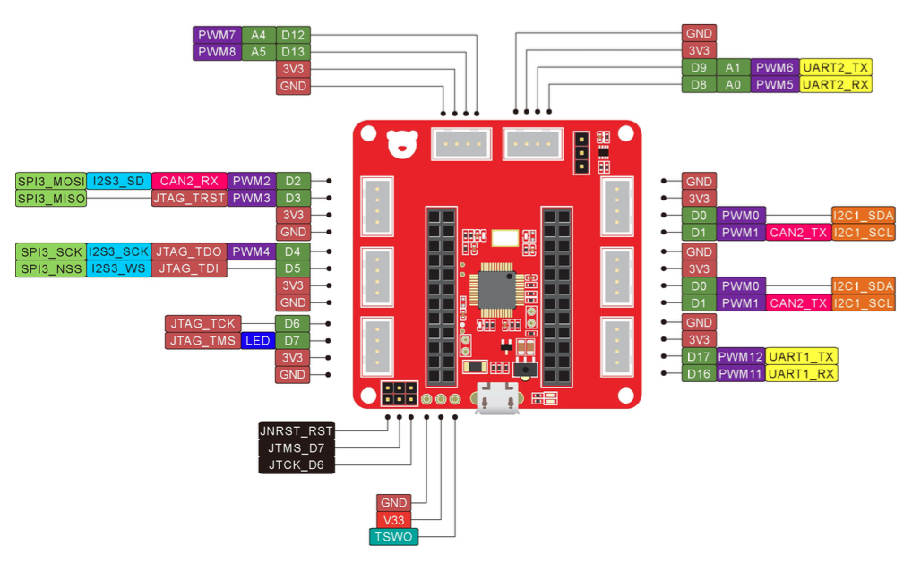
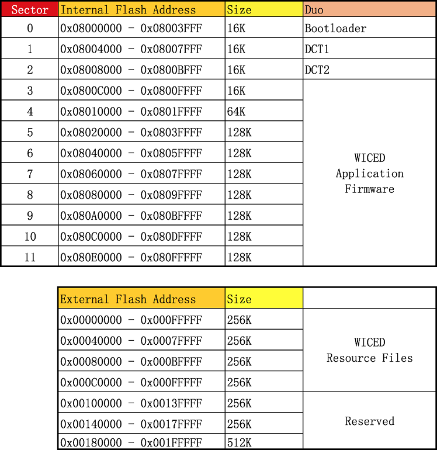

## WICED SDK Add-on for RedBear Duo

The [RedBear Duo](http://redbear.cc/duo/) supports Cypress WICED WiFi SDK by adding this add-on. The Duo IoT development kit has two boards, the Duo and the RBLink.

It is highly recommended you to use the RBLink for development with the Duo and WICED SDK since it is very good for debugging. However, it is also possible if you do not have the RBLink but also want to try the WICED SDK, you can use the bootloader DFU mode in this case.

Moreover, with the RBLink, if you have MFi license and the CoProcessor (authenticatiuon chip), you can solder it to the RBLink, then you can try MFi projects (e.g. HomeKit). In this case, you need to manually uncomment the following code in "WICED-SDK-3.7.0/platforms/RB_DUO/platform.c" or "WICED-SDK-3.7.0/platforms/RB_DUO_ext/platform.c":

	#if 0
	/* MFI-related variables */
	const wiced_i2c_device_t auth_chip_i2c_device =
	{
	    .port          = WICED_I2C_1,
	    .address       = 0x11,
	    .address_width = I2C_ADDRESS_WIDTH_7BIT,
	    .speed_mode    = I2C_STANDARD_SPEED_MODE,
	};
	const platform_mfi_auth_chip_t platform_auth_chip =
	{
	    .i2c_device = &auth_chip_i2c_device,
	    .reset_pin  = WICED_GPIO_NONE
	};
	#endif

*** Note: There is a known issue (bug) with OSX 10.11 (Apple is rewritting the USB stack), the RBLink will not work properly. As a workaround, please use bootloader DFU mode, RBLink MSD drag & drop method, OSX 10.10 or Windows at this moment.

*** Update: Apple replied and will fix this in OSX version 10.11.4 (tested on 10.11.4 beta and it works).

The Duo contains a ST32F205 MCU runs at 120 MHz, AP6212A WiFi (802.11 b/g/n 2.4GHz) + Bluetooth (4.1) combo module and an onboard 2 MB SPI Flash. The MCU has 1 MB Flash and 128 KB SRAM. The wireless module built around Broadcom BCM43438 A1 chip.

## Pinout

### Duo

### RBLink

The RBLink is a MCU flash programmer/debugger for the Duo to download firmware (also works for other ST MCUs) based on STLink, it also supports USB CDC for debugging using serial print out.

* For Windows, go to ST official website to download and install the [STLink driver](http://www.st.com/web/en/catalog/tools/PF260219):

	* http://www.st.com/web/en/catalog/tools/PF260219

* For OSX and Linux, no driver is required.

## Download WICED SDK

To use the Duo with WICED SDK 3.7.0:

* Download Cypress [WICED-SDK-3.7.0](https://community.cypress.com/docs/DOC-3122) from

	* https://community.cypress.com/docs/DOC-3122

* Unzip WICED-SDK-3.7.0 to your local file-system

* Download and copy the files in this add-on package to the WICED-SDK-3.7.0 folder, replace the original files.

For MFi developer, you need to apply from Cypress for another SDK.

## Memory Map

## Firmware

You can use either Windows, OSX or Linux to compile your firmware and use the bootloader DFU mode or the RBLink to upload your firmware for the Duo.

* See [Firmware Compilation Guide](docs/FW_Make.md) for details.

## Bluetooth Stack

The SDK comes with a closed source Bluetooth Stack, which has some limitations. If you want an open source stack, you can try [BTstack](https://github.com/bluekitchen/btstack/tree/master/port/wiced). For the older WICED 3.3.1 you need to use the `ble-api-cleanup` [branch](https://github.com/bluekitchen/btstack/tree/ble-api-cleanup/port/wiced).

## Limitations

* Debugging

	The SDK makes use USB to Serial port for debug messages, so you need to use the RBLink's USB to print out debug messages or any other USB to Serial (3.3V) dongle connecting the Duo uart pins. The Duo's USB will not work, unless we implement a CDC driver on it (To be done, if you can contribute, please contact us).

## Other Tools

* The RBLink is compatible with the [STLink Utility](http://www.st.com/web/en/catalog/tools/PF258168)
* ST Visual Programmer (STVP)
* qstlink
* pystlimk

## Resources

* [Cypress WICED WiFi](https://community.cypress.com/community/wiced-wifi)
* [BTstack for WICED](https://github.com/bluekitchen/btstack/tree/master/port/wiced)
